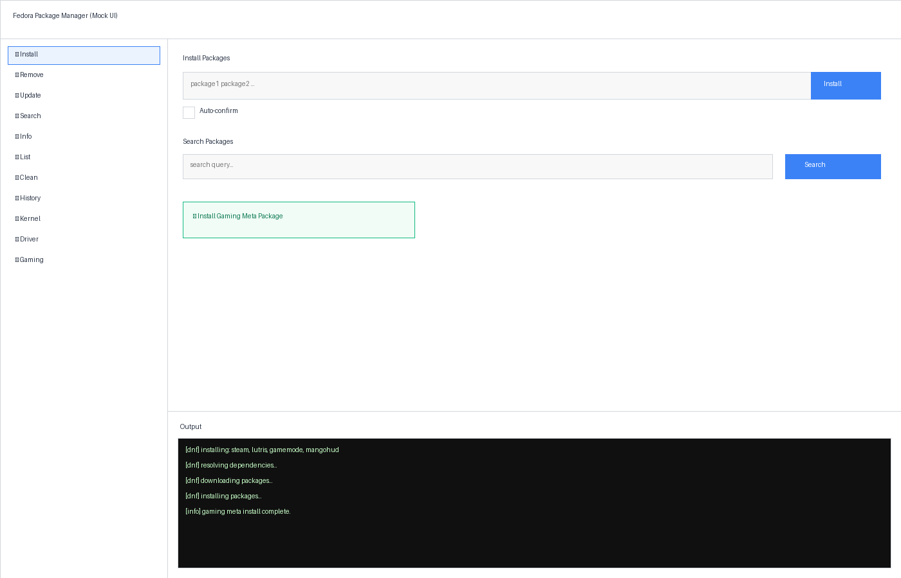

# Fedora Package Manager

A modern, user-friendly package manager for Fedora Linux, completely rewritten in native Rust for optimal performance, security, and reliability. Features both CLI and native GUI interfaces.

## 🚀 Quick Start

**Install both CLI and GUI (recommended):**
```bash
./install.sh --both
```

**GUI Installation (User-Friendly):**
```bash
# Option 1: Install with GUI (user-friendly)
./install.sh --gui

# Option 2: Install CLI with GUI included
./install.sh --both

# Option 3: Quick GUI-only install
sudo dnf copr enable uncodedchristiangamer/fedora-pm
sudo dnf install fedora-pm-gui

# Option 4: Direct GUI launch (if installed)
fedora-pm --gui
```

**Choose your installation:**
- `./install.sh --both` - CLI + GUI (complete setup)
- `./install.sh --cli` - CLI only (fast, lightweight)
- `./install.sh --gui` - GUI only (user-friendly)
- `./install.sh --user --both` - Install to user directory
- `./install.sh --cli --build` - Auto-build CLI from source
- `./install.sh --gui --build` - Build native GUI from source

## Features

### Package Management
- **Install packages** - Easy package installation
- **Remove packages** - Clean package removal
- **Update system** - Update all packages or specific ones
- **Search packages** - Search the package repository
- **Package information** - Get detailed info about packages
- **List packages** - List installed or available packages
- **Clean cache** - Clean package cache and metadata
- **History tracking** - Track all package management operations
- **Rollback operations** - Undo package installations and removals
- **Dependency visualization** - View dependency trees and reverse dependencies
- **Package groups** - Manage package groups easily

### Advanced Features
- **Kernel management** - Manage Linux kernels (list, install, remove, info)
- **CachyOS kernels** - Install optimized gaming kernels with BORE scheduler
- **Driver management** - Manage GPU drivers with Nvidia support (detect, install, remove, status)
- **Gaming meta package** - One-click installation of complete gaming setup (Steam, Lutris, Wine, GameMode, MangoHud, DXVK, etc.)
- **Flatpak integration** - Manage Flatpak applications alongside DNF packages
- **Repository management** - Enable, disable, add, and remove repositories
- **Security audits** - Check for security updates and CVE fixes
- **System health check** - Comprehensive system diagnostics (doctor command)

### Backup & Restore
- **Export package lists** - Save installed packages to a file
- **Import package lists** - Restore packages from a backup file
- **Flatpak export** - Include Flatpak apps in exports

### Download & Offline
- **Download packages** - Download packages without installing
- **Offline installation** - Install from downloaded RPM files
- **Download with dependencies** - Download packages with all dependencies

### Information & Analysis
- **Changelog viewer** - View package changelogs
- **What's new** - See changelogs for pending updates
- **Disk space analysis** - Analyze package sizes and disk usage
- **Orphaned packages** - Find and remove orphaned packages
- **Top packages** - List largest installed packages

### User Interface
- **CLI interface (Rust)** - Fast, reliable command-line interface with extensive features
- **Modern Qt GUI** - Beautiful graphical interface built with PySide6 (optional)
- **Quick install buttons** - One-click installation of gaming packages
- **Verbose logging** - Adjustable verbosity levels for debugging
- **Colored output** - Easy-to-read colored terminal output

### GUI Preview


**Modern Tabbed Interface:**
- **📦 Packages** - Install, remove, update, search, rollback, export/import
- **🔧 System** - Health check (doctor), security audit, disk analysis, gaming setup
- **📱 Flatpak** - Flatpak app management and Flathub setup
- **⚙️ Advanced** - Repository management, dependency analysis, downloads

See [GUI_FEATURES.md](GUI_FEATURES.md) for complete GUI documentation.
- See [GUI_RPM_INSTALLATION.md](GUI_RPM_INSTALLATION.md) for detailed RPM installation instructions.

## Installation

### 🚀 Quick Install (Recommended)

#### Recommended Installation
```bash
# Install both CLI and GUI (recommended)
./install.sh --both

# Install CLI only
./install.sh --cli

# Install GUI only
./install.sh --gui

# Install CLI only
./install.sh --cli

# Install GUI only  
./install.sh --gui

# Install to user directory
./install.sh --user --both

# Install to custom path
./install.sh --prefix /opt/fedora-pm --both

# Auto-build CLI if needed
./install.sh --cli --build

# Install GUI from COPR (when available)
```bash
# Enable COPR repository first
sudo dnf copr enable uncodedchristiangamer/fedora-pm

# Install GUI package
sudo dnf install fedora-pm-gui

# Launch GUI
fedora-pm-gui-launcher.py

# Alternative: Desktop entry
cp fedora-pm-gui.desktop ~/.local/share/applications/

## 🖥️ GUI Installation from COPR

Once fedora-pm is uploaded to COPR, you can install both CLI and GUI:

```bash
# 1. Enable COPR repository
sudo dnf copr enable uncodedchristiangamer/fedora-pm

# 2. Install CLI and GUI (recommended)
sudo dnf install fedora-pm fedora-pm-gui

# 3. Launch GUI
fedora-pm-gui

# Or use GUI launcher (more features)
fedora-pm-gui-launcher.py
```

## 📋 Installation Methods

### Method 1: Complete Setup (Recommended)
```bash
# Unified installer handles everything
./install.sh --both
```

### Method 2: GUI Only
```bash
# User-friendly GUI installation
./install.sh --gui
```

### Method 3: Manual from COPR
```bash
# Enable repository
sudo dnf copr enable uncodedchristiangamer/fedora-pm

# Install packages
sudo dnf install fedora-pm fedora-pm-gui
```

### Method 4: System-Wide Installation
```bash
# Install for all users
sudo dnf copr enable uncodedchristiangamer/fedora-pm
sudo dnf install fedora-pm fedora-pm-gui
```
```

# Preview what would be installed
./install.sh --dry-run --both
```

The unified installer automatically:
- ✅ Checks and installs dependencies (Rust, PySide6)
- ✅ Builds CLI from source when needed
- ✅ Installs both components to proper locations
- ✅ Sets correct permissions
- ✅ Provides clear usage instructions
- ✅ Supports dry-run for testing

### 📦 Installation Options

#### CLI Only Installation
- **Fast, lightweight** command-line tool
- Ideal for servers and headless systems
- Auto-builds with `--build` flag
- Full package management functionality

#### GUI Only Installation  
- **Modern Qt interface** with PySide6
- User-friendly graphical package manager
- Quick install buttons for common tasks
- Optional RPM package installation

#### Full Installation (CLI + GUI)
- **Complete package management suite**
- CLI for power users and scripting
- GUI for everyday use and beginners
- Both components work together seamlessly

### 🔧 Advanced Installation Options

#### GUI RPM Installation

For proper system package installation with desktop integration:

```bash
# See GUI_RPM_INSTALLATION.md for detailed build instructions
./install.sh --gui --rpm-install
```

This installs the GUI as a proper system package with:
- ✅ Desktop integration with application menu entry
- ✅ AppStream metadata for software centers  
- ✅ Automatic dependency resolution
- ✅ System-wide installation in `/usr/bin/`

#### Manual Installation

For advanced users who want full control:

```bash
# CLI only
cargo build --release
sudo install -m 0755 target/release/fedora-pm /usr/local/bin/fedora-pm

# GUI only (requires PySide6)
sudo dnf install python3-pyside6 python3-pyside6-qtwidgets
sudo ln -s $(pwd)/fedora-pm-gui.py /usr/local/bin/fedora-pm-gui
```

## 📦 RPM Package Installation (NEW)

The fedora-pm-gui can now be built and installed as a proper Fedora RPM package:

```bash
# Build and install GUI RPM
./install.sh --gui --rpm-install
```

**Features of RPM Installation:**
- ✅ Proper desktop integration with application menu entry
- ✅ AppStream metadata for software centers
- ✅ Automatic dependency resolution (PySide6, fedora-pm CLI)
- ✅ Validated desktop file and metadata
- ✅ System-wide installation in `/usr/bin/`
- ✅ One-click build process with validation

**What gets installed:**
- `/usr/bin/fedora-pm-gui` - Main GUI executable
- `/usr/bin/fedora-pm-gui-launcher` - Fallback launcher
- `/usr/share/applications/fedora-pm.desktop` - Desktop entry
- `/usr/share/metainfo/fedora-pm-gui.metainfo.xml` - AppStream metadata
- Documentation in `/usr/share/doc/fedora-pm-gui/`

See [GUI_RPM_INSTALLATION.md](GUI_RPM_INSTALLATION.md) for complete installation and troubleshooting guide.

## Requirements

### System Requirements
- Fedora Linux with `dnf` and `rpm`
- sudo access for package operations
- Rust toolchain (`cargo`, `rustc`) for building the CLI from source

### GUI Requirements
- **PySide6** (Qt for Python) - For the graphical interface
  ```bash
  sudo dnf install python3-pyside6 python3-pyside6-qtwidgets python3-pyside6-qtgui python3-pyside6-qtcore
  ```

**GUI RPM Installation:**
- **Build requirements**: `rpm-build`, `desktop-file-utils`, `libappstream-glib`
- See [GUI_RPM_INSTALLATION.md](GUI_RPM_INSTALLATION.md) for detailed RPM build and install instructions

### Optional Requirements
- **RPM Fusion repositories** - Required for some features (Nvidia drivers, Steam, etc.)
  ```bash
  sudo dnf install https://mirrors.rpmfusion.org/free/fedora/rpmfusion-free-release-$(rpm -E %fedora).noarch.rpm
  sudo dnf install https://mirrors.rpmfusion.org/nonfree/fedora/rpmfusion-nonfree-release-$(rpm -E %fedora).noarch.rpm
  ```

## Usage

### GUI Version

Launch the graphical interface:

```bash
fedora-pm-gui
```

Or find "Fedora Package Manager" in your applications menu.

**GUI RPM Installation:**
```bash
# Build and install as system package
./install.sh --gui --rpm-install
```

The GUI will appear in applications menu after RPM installation with proper desktop integration.

The GUI provides:
- **Command selector** - Choose from install, remove, update, search, info, list, clean
- **Quick Install** - One-click installation of Fedora Gaming Meta package
- **Auto-confirm option** - Skip confirmation prompts for batch operations
- **Real-time output** - See command output in a terminal-style window
- **Modern interface** - Beautiful Qt-based UI with customizable themes

**Quick Install Gaming Meta:**
Click the "🎮 Install Gaming Meta Package" button in the GUI to install a complete gaming setup including Steam, Lutris, Wine, GameMode, MangoHud, DXVK, and more. The GUI will automatically:
- Check and enable RPM Fusion repositories if needed
- Build the gaming meta package if not already built
- Install all gaming packages with a single click

### CLI Version

### Install packages
```bash
fedora-pm install vim git curl
fedora-pm install vim -y  # Auto-confirm
```

### Remove packages
```bash
fedora-pm remove old-package
fedora-pm remove package1 package2 -y
```

### Update system
```bash
fedora-pm update          # Update all packages
fedora-pm update vim git  # Update specific packages
fedora-pm update -y       # Auto-confirm
```

### Search for packages
```bash
fedora-pm search python
fedora-pm search editor
```

### Get package information
```bash
fedora-pm info vim
fedora-pm info git
```

### List packages
```bash
fedora-pm list installed           # List all installed packages
fedora-pm list installed python    # Filter installed packages
fedora-pm list available            # List available packages
fedora-pm list available editor     # Filter available packages
```

### Clean cache
```bash
fedora-pm clean                     # Clean everything
fedora-pm clean --no-cache          # Clean only metadata
fedora-pm clean --no-metadata       # Clean only cache
```

### View history
```bash
fedora-pm history           # Show last 10 operations
fedora-pm history -n 20     # Show last 20 operations
```

### Rollback operations
```bash
fedora-pm rollback                    # Undo last operation
fedora-pm rollback --id 5             # Rollback specific operation by ID
fedora-pm rollback --yes              # Skip confirmation
```

### Dependency management
```bash
fedora-pm deps vim --tree             # Show dependency tree
fedora-pm deps vim --reverse          # Show what depends on vim
```

### Package groups
```bash
fedora-pm group list                  # List all package groups
fedora-pm group info "Development Tools"  # Show group info
fedora-pm group install "Development Tools"  # Install a group
fedora-pm group remove "Development Tools"   # Remove a group
```

### System health check
```bash
fedora-pm doctor                      # Run comprehensive system check
# Checks: broken dependencies, orphaned packages, disk space,
#         repositories, duplicates, security updates
```

### Flatpak management
```bash
fedora-pm flatpak setup-flathub       # Setup Flathub repository
fedora-pm flatpak search spotify      # Search for Flatpak apps
fedora-pm flatpak install com.spotify.Client  # Install Flatpak
fedora-pm flatpak list                # List installed Flatpaks
fedora-pm flatpak update              # Update all Flatpaks
fedora-pm flatpak remove com.spotify.Client   # Remove Flatpak
fedora-pm flatpak info com.spotify.Client     # Show Flatpak info
```

### Export/Import packages
```bash
fedora-pm export packages.txt         # Export installed packages
fedora-pm export packages.txt --with-flatpak  # Include Flatpaks
fedora-pm import packages.txt         # Import and install packages
fedora-pm import packages.txt --yes   # Skip confirmation
```

### Repository management
```bash
fedora-pm repo list                   # List enabled repositories
fedora-pm repo list --all             # List all repositories
fedora-pm repo enable rpmfusion-free  # Enable a repository
fedora-pm repo disable updates-testing  # Disable a repository
fedora-pm repo add myrepo https://example.com/repo  # Add repository
fedora-pm repo remove myrepo          # Remove repository
fedora-pm repo info fedora            # Show repository info
fedora-pm repo refresh                # Refresh repository metadata
```

### Security management
```bash
fedora-pm security check              # Check for security updates
fedora-pm security list               # List security updates
fedora-pm security list --severity critical  # Filter by severity
fedora-pm security update             # Install security updates only
fedora-pm security audit              # Full security audit
fedora-pm security cve CVE-2024-1234  # Check specific CVE
fedora-pm security info FEDORA-2024-123  # Show advisory info
```

### Download packages
```bash
fedora-pm download vim git            # Download to current directory
fedora-pm download vim --dest /tmp    # Download to specific directory
fedora-pm download vim --with-deps    # Download with dependencies
fedora-pm install-offline *.rpm       # Install downloaded RPMs
```

### Changelog viewer
```bash
fedora-pm changelog vim               # View full changelog
fedora-pm changelog vim -n 5          # Show last 5 entries
fedora-pm whatsnew                    # Show changelogs for pending updates
```

### Disk space analysis
```bash
fedora-pm size --analyze              # Full disk space analysis
fedora-pm size --top 20               # Show 20 largest packages
fedora-pm size --total                # Show total package size
fedora-pm clean-orphans               # Remove orphaned packages
fedora-pm clean-orphans --yes         # Skip confirmation
```

### Verbose output
```bash
fedora-pm -v install vim              # Verbose output
fedora-pm -vv install vim             # Very verbose (debug)
fedora-pm --quiet install vim         # Minimal output
```

### Kernel management
```bash
fedora-pm kernel current              # Show current running kernel
fedora-pm kernel list                 # List installed kernels
fedora-pm kernel list --available     # List available kernels
fedora-pm kernel install              # Install latest kernel
fedora-pm kernel install 6.5.0       # Install specific kernel version
fedora-pm kernel remove 6.4.0        # Remove specific kernel version
fedora-pm kernel remove-old           # Remove old kernels (keeps 2 newest)
fedora-pm kernel remove-old --keep 3  # Keep 3 newest kernels
fedora-pm kernel info                 # Show current kernel info
fedora-pm kernel info 6.5.0          # Show specific kernel info
```

### CachyOS kernel management
```bash
fedora-pm kernel cachyos list         # List available CachyOS kernels
fedora-pm kernel cachyos check        # Check CachyOS repository status
fedora-pm kernel cachyos enable gcc   # Enable GCC-built kernel repository
fedora-pm kernel cachyos enable lto   # Enable LLVM-ThinLTO kernel repository
fedora-pm kernel cachyos enable both  # Enable both repositories
fedora-pm kernel cachyos check-cpu    # Check CPU instruction set support
fedora-pm kernel cachyos install      # Install default CachyOS kernel (GCC)
fedora-pm kernel cachyos install default --build lto  # Install default (LTO)
fedora-pm kernel cachyos install lts  # Install LTS kernel with BORE scheduler
fedora-pm kernel cachyos install rt   # Install real-time kernel
fedora-pm kernel cachyos install server  # Install server kernel (300Hz)
```

**CachyOS Kernel Types:**
- **default**: Standard optimized kernel with BORE scheduler
- **lts**: Long-Term Support kernel with BORE scheduler (requires x86-64-v2)
- **rt**: Real-time kernel with BORE scheduler
- **server**: Server kernel with 300Hz and EEVDF scheduler (requires x86-64-v2)

**Build Types:**
- **gcc**: GCC-built kernels (default)
- **lto**: LLVM-ThinLTO built kernels (better optimizations)

**Note:** Most CachyOS kernels require x86-64-v3 CPU support. LTS and Server kernels require x86-64-v2. Use `check-cpu` to verify your CPU support.

### Driver management
```bash
fedora-pm driver status              # Show status of all detected GPUs
fedora-pm driver detect              # Detect installed GPU hardware
fedora-pm driver check               # Check Nvidia driver status
fedora-pm driver list nvidia        # List available Nvidia drivers
fedora-pm driver install nvidia      # Install latest Nvidia drivers
fedora-pm driver install nvidia --cuda  # Install Nvidia drivers with CUDA
fedora-pm driver install nvidia --version 535  # Install specific driver version
fedora-pm driver remove nvidia       # Remove Nvidia drivers
fedora-pm driver cuda install        # Install CUDA toolkit
```

**Note:** Nvidia drivers require RPM Fusion repositories. If not enabled, the tool will provide instructions. You can enable them manually:
```bash
sudo dnf install https://mirrors.rpmfusion.org/free/fedora/rpmfusion-free-release-$(rpm -E %fedora).noarch.rpm
sudo dnf install https://mirrors.rpmfusion.org/nonfree/fedora/rpmfusion-nonfree-release-$(rpm -E %fedora).noarch.rpm
```

### Gaming Meta Package

Install a complete gaming setup with one command:

**Via GUI:**
- Click the "🎮 Install Gaming Meta Package" button in the GUI

**Via CLI:**
```bash
# Enable RPM Fusion repositories first
./enable-repos.sh

# Install gaming meta package (built automatically)
fedora-pm gaming install
```

**What's included:**
- Steam - Digital game distribution platform
- Lutris - Open gaming platform for Linux
- Wine + Winetricks - Windows compatibility layer
- GameMode - Automatic performance optimization
- MangoHud - FPS/temperature overlay
- DXVK/VKD3D - DirectX to Vulkan translation layers
- Vulkan - Modern graphics API
- Gaming fonts - Unicode and emoji support
- Controller tools - Gamepad configuration utilities
- PipeWire - Low-latency audio stack

See `fedora-gaming-meta-README.md` and `GAMING_META_QUICKSTART.md` for detailed information.

## Configuration

Configuration is stored in `~/.fedora-pm/config.json`. You can edit this file to customize behavior:

```json
{
  "auto_clean": false,
  "parallel_downloads": true,
  "fastest_mirror": true,
  "color_output": true,
  "history_file": "~/.fedora-pm/history.json"
}
```

## History

All package management operations are logged to `~/.fedora-pm/history.json` for tracking purposes.

## Examples

### Basic Package Management
```bash
# Install development tools
fedora-pm install git vim python3-pip nodejs

# Search for text editors
fedora-pm search editor

# Update system
fedora-pm update -y

# Check what's installed
fedora-pm list installed | grep python

# Clean up after updates
fedora-pm clean

# View recent operations
fedora-pm history

# Rollback last operation
fedora-pm rollback
```

### System Maintenance
```bash
# Run system health check
fedora-pm doctor

# Check for security updates
fedora-pm security audit

# Analyze disk space
fedora-pm size --analyze

# Clean orphaned packages
fedora-pm clean-orphans -y

# See what's new in updates
fedora-pm whatsnew
```

### Backup and Restore
```bash
# Export installed packages
fedora-pm export my-packages.txt --with-flatpak

# On another system, restore packages
fedora-pm import my-packages.txt -y
```

### Flatpak Management
```bash
# Setup Flathub
fedora-pm flatpak setup-flathub

# Install apps
fedora-pm flatpak install com.spotify.Client
fedora-pm flatpak install org.gimp.GIMP

# Update all Flatpaks
fedora-pm flatpak update -y
```

### Repository Management
```bash
# Enable RPM Fusion
fedora-pm repo enable rpmfusion-free
fedora-pm repo enable rpmfusion-nonfree

# List all repositories
fedora-pm repo list --all

# Refresh metadata
fedora-pm repo refresh
```

### Kernel Management
```bash
# List kernels
fedora-pm kernel list
fedora-pm kernel install
fedora-pm kernel remove-old --keep 2

# CachyOS kernels
fedora-pm kernel cachyos check-cpu
fedora-pm kernel cachyos enable gcc
fedora-pm kernel cachyos install lts
```

### Driver Management
```bash
# Check driver status
fedora-pm driver status
fedora-pm driver detect

# Install Nvidia drivers
fedora-pm driver install-nvidia --cuda
fedora-pm driver check-nvidia
```

### Gaming Setup
```bash
# Install complete gaming setup (via CLI)
./enable-repos.sh
fedora-pm gaming install

# Or use the GUI - click "Install Gaming Meta Package" button
fedora-pm-gui
```

### Advanced Usage
```bash
# View dependency tree
fedora-pm deps firefox --tree

# Download packages for offline use
fedora-pm download firefox --with-deps --dest /media/usb

# Install offline
fedora-pm install-offline /media/usb/*.rpm -y

# View changelog before updating
fedora-pm changelog kernel

# Install only security updates
fedora-pm security update -y

# Find largest packages
fedora-pm size --top 10
```

## How it works

This package manager is a wrapper around Fedora's native `dnf` and `rpm` tools, providing:
- A cleaner, more intuitive interface (both CLI and GUI)
- Operation history tracking
- Better output formatting
- Configuration management
- One-click gaming setup

### Architecture

**CLI Interface (Rust):**
- Native Rust binary wrapping Fedora package tooling
- Fast, scriptable, and dependency-light once built
- Full feature parity with the GUI for core operations

**GUI Interface (PySide6):**
- Built with PySide6 (Qt for Python)
- Modern, customizable interface
- Wraps CLI commands for user-friendly operation
- Includes quick install buttons for common tasks

### Under the Hood

The tool uses:
- Rust CLI orchestrating `dnf`/`rpm` for package, kernel, and driver operations
- `uname` for kernel version detection
- `lspci` for GPU hardware detection
- `nvidia-smi` for Nvidia driver status checking
- `dnf copr` for managing COPR repositories (CachyOS kernels)
- RPM Fusion repositories for Nvidia drivers (akmod-nvidia)
- CachyOS kernels via COPR (bieszczaders/kernel-cachyos)
- Gaming meta package provided as an RPM-based meta-package for complete gaming setup

## Customization

### GUI Appearance

The GUI supports extensive customization through Qt stylesheets. See `GUI_CUSTOMIZATION.md` for:
- Color themes (light, dark, custom)
- Font customization
- Button styles
- Window layout adjustments
- And more!

### Gaming Meta Package

Customize the gaming meta package by editing `fedora-gaming-meta.spec` to add or remove packages. See `fedora-gaming-meta-README.md` for details.

## Related Files

- `install.sh` - Unified installation script (CLI + GUI)
- `enable-repos.sh` - Repository enablement script
- `fedora-pm-gui.py` - Qt GUI interface
- `fedora-pm-gui-rpm.spec` - GUI RPM specification file
- `fedora-pm-gui-launcher.py` - GUI fallback launcher
- `GUI_RPM_INSTALLATION.md` - Complete GUI RPM installation guide
- `setup.py` - Python packaging configuration
- `fedora_pm_gui/` - Python package structure
- `fedora-pm.desktop` - Desktop entry file
- `fedora-gaming-meta.spec` - Gaming meta package spec file
- `GUI_CUSTOMIZATION.md` - Guide for customizing GUI appearance
- `fedora-gaming-meta-README.md` - Detailed gaming meta package documentation
- `GAMING_META_QUICKSTART.md` - Quick start guide for gaming setup

## RPM Packaging

The fedora-pm-gui supports **complete RPM packaging** for Fedora systems:

### 📦 RPM Features
- **Proper Dependencies**: PySide6 packages correctly specified
- **Desktop Integration**: Desktop file and AppStream metadata
- **System Integration**: Installs to `/usr/bin/` with proper permissions
- **Validation**: Desktop file and metadata validation during build

### 📂 RPM Files
- `fedora-pm-gui-rpm.spec` - Main RPM specification
- `GUI_RPM_INSTALLATION.md` - Complete installation guide

### 🔧 Build Requirements
```bash
# Install build dependencies
sudo dnf install rpm-build rpmdevtools python3-pyside6 desktop-file-utils libappstream-glib

# Build and install via unified script
./install.sh --gui --rpm-install
```

### 📱 Installation
```bash
# Install via unified script (recommended)
./install.sh --gui --rpm-install

# Or install built RPM manually
sudo dnf install rpmbuild/RPMS/noarch/fedora-pm-gui-*.noarch.rpm
```

## License

This project is open source and available for use and modification.

---

## 🖥️ Complete GUI Installation Guide

### 🚀 Quick GUI Installation (Recommended)

#### Option 1: From COPR Repository (When Available)
```bash
# Enable COPR repository
sudo dnf copr enable uncodedchristiangamer/fedora-pm

# Install GUI package
sudo dnf install fedora-pm-gui

# Launch GUI
fedora-pm-gui
# or find "Fedora Package Manager" in applications menu
```

#### Option 2: Complete Setup with CLI
```bash
# Install both CLI and GUI (recommended)
./install.sh --both

# Launch GUI from command line
fedora-pm-gui

# Or use GUI launcher
python3 fedora-pm-gui-launcher.py
```

#### Option 3: GUI Only Installation
```bash
# User-friendly GUI installation
./install.sh --gui

# Install GUI to user directory
./install.sh --user --gui

# System-wide GUI installation
sudo dnf install fedora-pm-gui
```

#### Option 4: Manual Installation
```bash
# Install dependencies first
sudo dnf install python3-pyside6 python3-pyside6-qtwidgets python3-pyside6-qtcore python3-pyside6-qtgui qt6-base-devel

# Manual GUI installation
python3 fedora_pm_gui/main.py

# Create desktop entry
cp fedora-pm.desktop ~/.local/share/applications/
```

### 📱 GUI Features Overview

#### 🎮 Main Interface
- **Package Management Tab**: Install, remove, update, search packages with visual feedback
- **System Tab**: Health check, kernel management, driver setup, security updates
- **Gaming Tab**: One-click Steam installation, driver management, gaming optimizations
- **Settings Tab**: Customization, themes, notifications, preferences
- **Flatpak Tab**: Sandbox app management alongside native packages
- **Repo Tab**: Repository management with enabling/disabling
- **Export/Import Tab**: Package backup and restoration
- **History Tab**: Operation history with rollback capabilities
- **Update Tab**: System and package updates with progress tracking
- **Size Tab**: Disk space analysis and cache management
- **Orphan Cleanup**: Find and remove unused packages
- **Help Tab**: Built-in help system with examples

#### 🎨 Gaming Center
- **One-Click Steam Installation**: Automatically configures Steam and dependencies
- **Driver Management**: Easy Nvidia driver installation and configuration
- **Gaming Kernel Options**: CachyOS kernels with BORE scheduler
- **Performance Tweaks**: System optimization for better gaming performance
- **Compatibility Layers**: Proton, GE-Proton, wine-gecko configuration
- **Emulator Support**: Retro gaming with RetroArch, PPSSPP
- **Game Launch Integration**: Direct integration with Steam and other platforms

#### 🎨 Customization
- **Dark/Light Themes**: System-integrated color schemes
- **Font Selection**: Customizable fonts and sizes
- **Color Schemes**: Personalized interface colors
- **Window Management**: Tabbed or single-window interface
- **Keyboard Shortcuts**: Configurable hotkeys for all functions
- **Language Support**: Multiple interface languages
- **Panel Layouts**: Customizable sidebar and toolbar arrangements

### 🔧 Installation Methods

#### Method 1: Unified Installer (Recommended)
```bash
# Automated setup that handles everything
./install.sh --both

# Features:
# - Automatically checks and installs dependencies
# - Builds CLI from source if needed
# - Installs GUI with proper desktop integration
# - Sets correct permissions and paths
# - Provides clear success/failure messages
```

#### Method 2: Manual Package Management
```bash
# Check if GUI is installed
dnf list installed | grep fedora-pm-gui

# Install GUI package
sudo dnf install fedora-pm-gui

# Verify installation
which fedora-pm-gui
```

#### Method 3: Source Installation
```bash
# Clone repository
git clone https://github.com/ryan1501/fedora-pm
cd fedora-pm

# Install GUI dependencies
sudo dnf install python3-pyside6 python3-pyside6-qtwidgets python3-pyside6-qtcore python3-pyside6-qtgui qt6-base-devel

# Build GUI
python3 fedora_pm_gui/main.py

# Create desktop entry
sudo cp fedora-pm-gui.desktop /usr/share/applications/

# Install Python dependencies
sudo dnf install python3-pyside6 python3-pyside6-qtwidgets python3-pyside6-qtcore python3-pyside6-qtgui
```

### 🚀 GUI Usage Examples

#### Basic Operations
```bash
# Launch GUI
fedora-pm-gui

# Install package from GUI
# (Click "Install Packages" tab and search for "vim")

# System health check from GUI
# (Click "System" tab -> "Health Check")

# Install gaming setup from GUI
# (Click "Gaming" tab -> "Install Gaming Meta")
```

#### Advanced GUI Operations
```bash
# Custom launch arguments
fedora-pm-gui --theme dark --debug

# Launch specific module
fedora-pm-gui --module package_manager

# Check system integration
fedora-pm-gui --diagnostics

# Set custom configuration directory
fedora-pm-gui --config ~/.config/fedora-pm
```

### 🎯 System Integration

#### Desktop Integration
```bash
# The GUI automatically creates desktop entry
# Available in:
# - GNOME Applications menu
# - KDE Application Launcher
# - XFCE Applications Menu
# - Cinnamon Applications Menu

#### Command Line Integration
```bash
# CLI can launch GUI
fedora-pm gui

# GUI can control CLI operations
fedora-pm-gui --cli-integration --install vim

# Both work together seamlessly
```

### 📚 Troubleshooting GUI

#### Installation Issues
```bash
# Check for missing Python dependencies
python3 -c "import PySide6" && echo "PySide6 OK" || echo "PySide6 missing"

# Check Qt installation
python3 -c "from PySide6 import QtCore" && echo "Qt6 OK" || echo "Qt6 missing"

# Check GUI permissions
ls -la /usr/bin/fedora-pm-gui
ls -la /usr/share/applications/fedora-pm-gui.desktop
```

#### Runtime Issues
```bash
# Run GUI with debug output
QT_DEBUG_PLUGINS=1 fedora-pm-gui

# Check for library conflicts
export QT_LOGGING_RULES="*=true"
export QT_DEBUG_PLUGINS=1
fedora-pm-gui 2>&1 | tee gui-debug.log

# Check for missing system libraries
ldd /usr/bin/fedora-pm-gui
```

### 📱 GUI Documentation

For complete GUI features and configuration options, see:
- `GUI_FEATURES.md` - Complete feature documentation
- `GUI_RPM_INSTALLATION.md` - Detailed RPM build instructions
- `fedora_pm_gui/` directory - GUI source code documentation

### 🚀 Getting Started with GUI

1. **Start with the unified installer:**
   ```bash
   ./install.sh --both
   ```

2. **Launch the GUI:**
   ```bash
   fedora-pm-gui
   ```

3. **Explore the interface:**
   - Click through tabs to discover features
   - Use the search function to find packages
   - Check system health from the System tab
   - Customize appearance in Settings

4. **Advanced usage:**
   - Use CLI and GUI together for maximum productivity
   - Access CLI functionality directly from GUI
   - Automate tasks using CLI scripts and GUI visualization

The fedora-pm GUI provides a comprehensive, modern package management experience with gaming center capabilities and full CLI integration. Enjoy the enhanced graphical interface! 🎮

